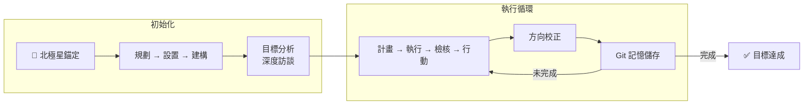

# Self-Evolving Agent

[](./skills/SKILL.md)
[](./LICENSE)
[](./skills/)

> A Claude Code skill that enables autonomous goal achievement through iterative learning and self-improvement.

**[Quick Install](#quick-install)** | [Documentation](./skills/SKILL.md) | [Usage Manual](./USAGE.md) | [Examples](./examples/) | [Troubleshooting](./docs/TROUBLESHOOTING.md)

## 使用方式

```bash
/evolve [目標描述]
```

**適用場景：**

| 場景 | 說明 | 範例 |
|------|------|------|
| 🎯 **複雜目標** | 多步驟、跨領域任務 | `/evolve 建立完整的用戶認證系統` |
| 🔄 **迭代開發** | 反覆調整直到達標 | `/evolve 優化 API 回應時間降低 50%` |
| 🧭 **探索研究** | 方向不明確時 | `/evolve 研究 codebase 架構 --explore` |
| 💡 **項目發想** | 從零開始構思 | `/evolve 幫我發想 side project 功能` |
| 📝 **制定規格** | 釐清需求 | `/evolve 規劃訂單系統規格` |
| 📚 **累積經驗** | 記錄解決方案 | `/evolve 修復 bug 並記錄供未來參考` |

**參數：**

| 參數 | 說明 |
|------|------|
| `--explore` | 探索模式 — 允許自主選擇方向 |
| `--emergence` | 涌現模式 — 啟用跨領域連結 |
| `--autonomous` | 自主模式 — 完全自主創新 |
| `--max-iterations N` | 最大迭代次數（預設 10） |
| `--from-spec NAME` | 從 spec-workflow 執行 |

## 運作原理



1. **北極星錨定**：任務開始前建立願景和完成標準，避免後續迷失方向
2. **環境準備**：檢查專案環境、安裝依賴、確認可以開始
3. **目標分析**：透過深度訪談釐清需求，分解成可執行的子任務
4. **PDCA 循環**：反覆執行「計畫 → 執行 → 檢核 → 行動」直到完成
5. **方向校正**：每個里程碑後對照北極星，確保沒有偏離目標
6. **記憶儲存**：將學到的經驗存入 Git，供未來任務參考

> 💡 採用原子化架構，按需載入模組，Token 降低 92%。9 個強制檢查點確保行為穩定。

## Quick Install

**One-line install (Recommended)**

```bash
curl -fsSL https://raw.githubusercontent.com/miles990/self-evolving-agent/main/install.sh | bash

# Full install with hooks and memory
curl -fsSL https://raw.githubusercontent.com/miles990/self-evolving-agent/main/install.sh | bash -s -- --with-hooks --with-memory
```

**Manual install**

```bash
git clone https://github.com/miles990/self-evolving-agent.git
cp -r self-evolving-agent/skills /path/to/your/project/.claude/skills/evolve
```

**Use with skillpkg**

```bash
skillpkg install github:miles990/self-evolving-agent
```

## 核心哲學

**AI 協作的本質：透過抽象化介面溝通**

| 傳統軟體 | AI 協作 | 作用 |
|----------|---------|------|
| API | MCP | 能力邊界（能做什麼） |
| SDK/Library | Tools | 具體實作（怎麼做） |
| 文檔+Best Practices | Skill | 領域知識（何時用什麼） |
| Config | CLAUDE.md | 上下文約束（專案規範） |

> **Skill 不只是知識，是「封裝好的判斷力」** — 告訴 AI 在什麼情況下，用什麼方式，達成什麼目標

## 模組文檔

| Module | Description |
|--------|-------------|
| [00-getting-started](./skills/00-getting-started/) | 入門與環境設定 |
| [01-core](./skills/01-core/) | 核心流程（PSB + PDCA） |
| [02-checkpoints](./skills/02-checkpoints/) | 強制檢查點（護欄） |
| [03-memory](./skills/03-memory/) | 記憶系統操作 |
| [04-emergence](./skills/04-emergence/) | 涌現機制 |
| [05-integration](./skills/05-integration/) | 外部工具整合 |
| [06-scaling](./skills/06-scaling/) | 大規模專案優化 |
| [99-evolution](./skills/99-evolution/) | 自我進化機制 |

## 相關資源

**Related Projects**

| Project | Description |
|---------|-------------|
| [claude-domain-skills](https://github.com/miles990/claude-domain-skills) | 16 non-technical domain skills |
| [claude-software-skills](https://github.com/miles990/claude-software-skills) | Software development skills |
| [skillpkg](https://github.com/anthropics/skillpkg) | Skill package manager |

**References**

- [Reflexion Paper](https://arxiv.org/abs/2303.11366)
- [OpenAI Self-Evolving Agents Cookbook](https://cookbook.openai.com/examples/partners/self_evolving_agents/autonomous_agent_retraining)
- [Andrew Ng - Agentic Design Patterns](https://www.deeplearning.ai/the-batch/agentic-design-patterns-part-2-reflection/)
- [makepad-skills](https://github.com/ZhangHanDong/makepad-skills) - Atomic architecture inspiration

---

> 📝 *本專案也是經由 Self-Evolving Agent 迭代開發而成*

## License

MIT
