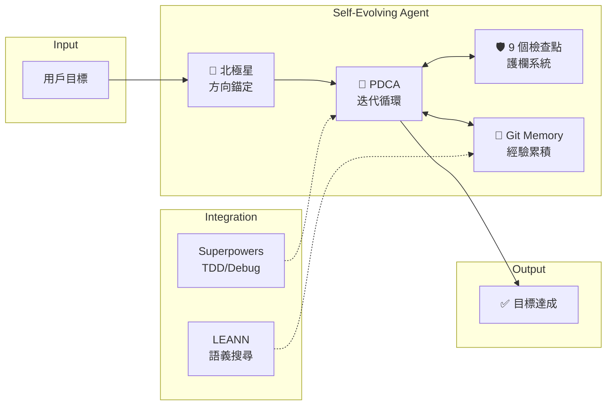
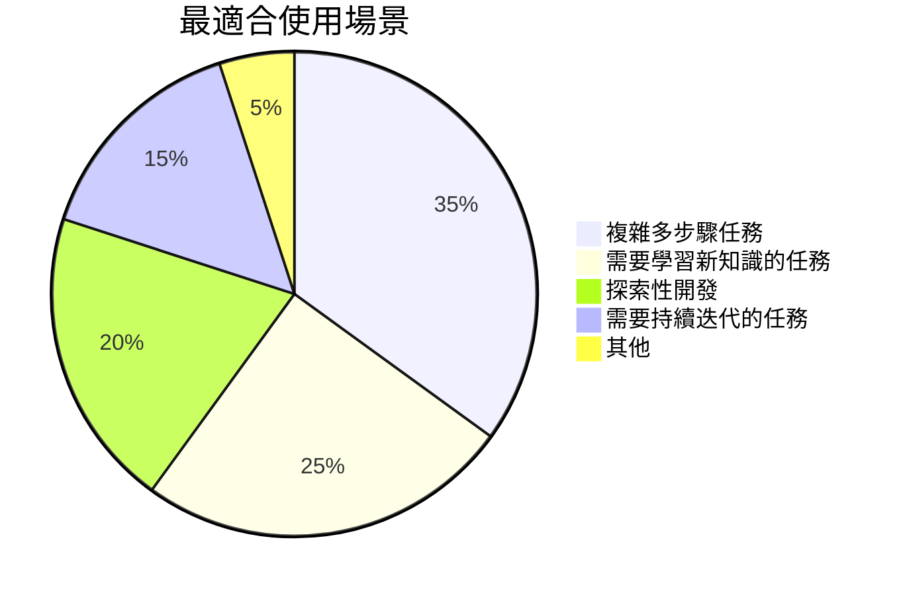
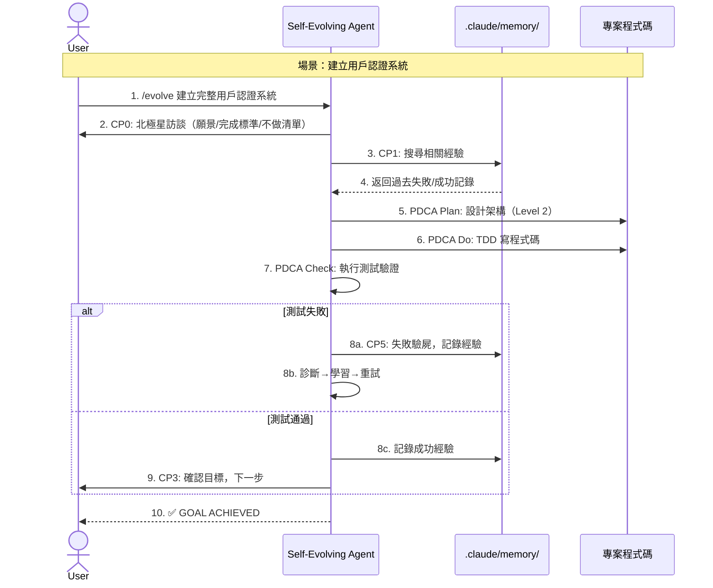
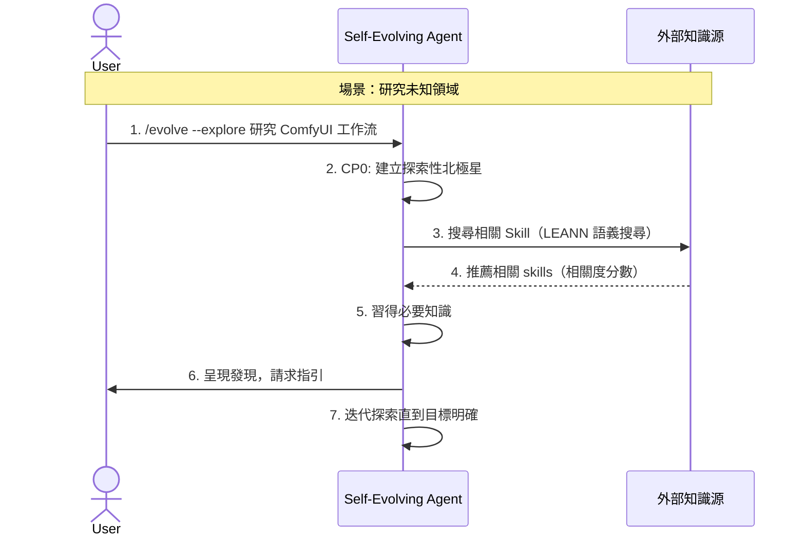
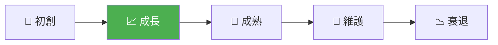
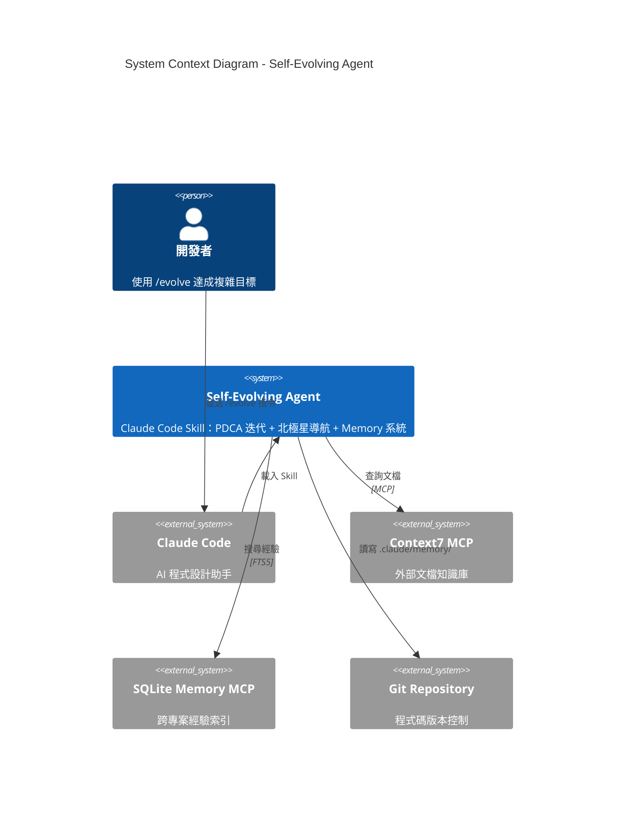
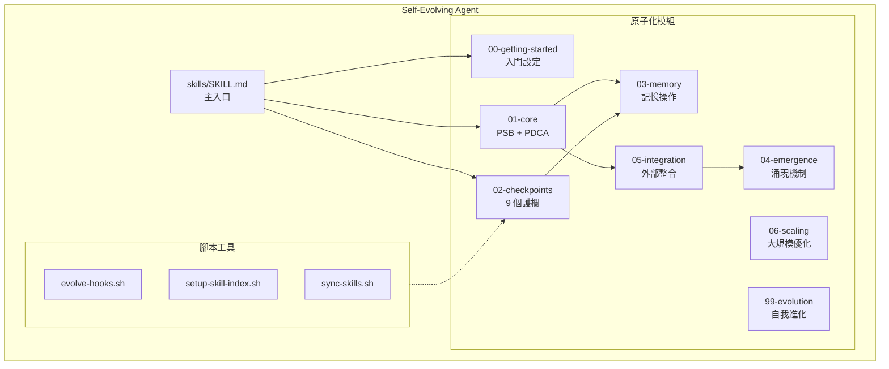
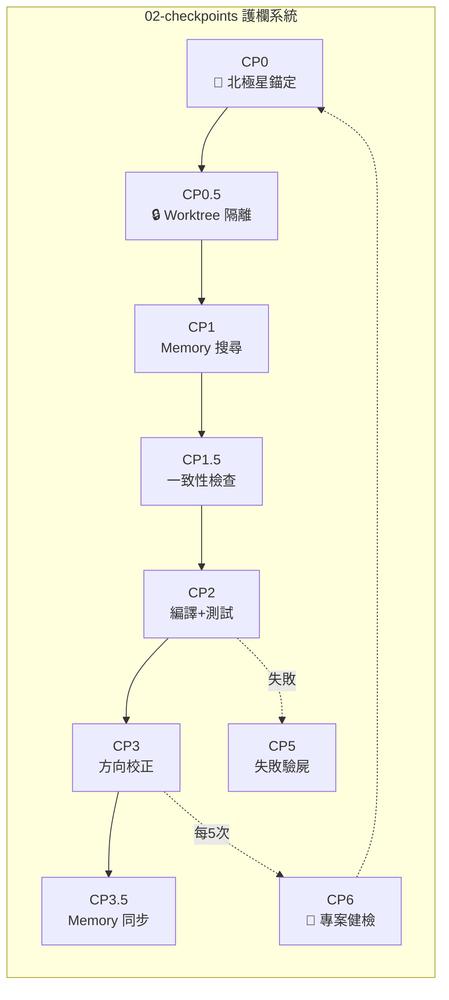
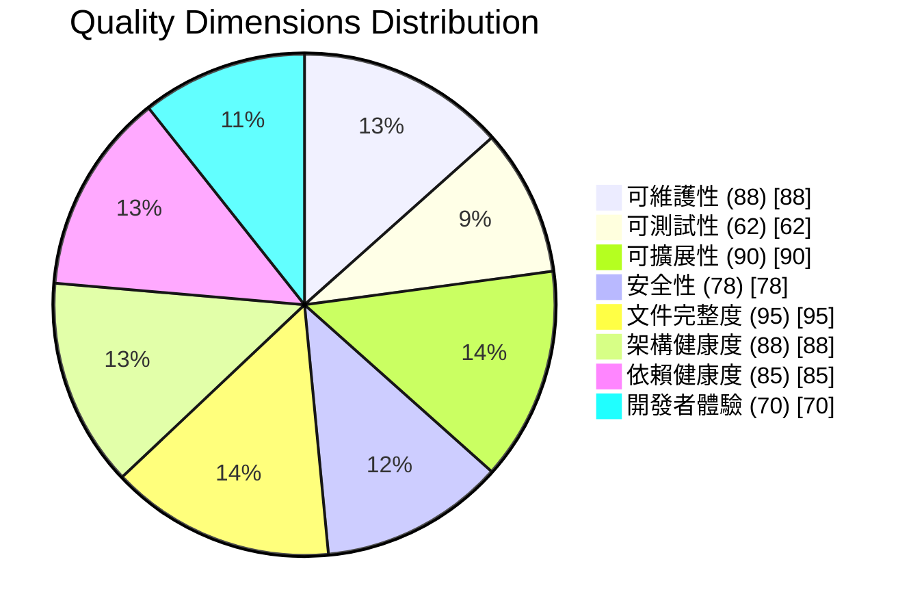
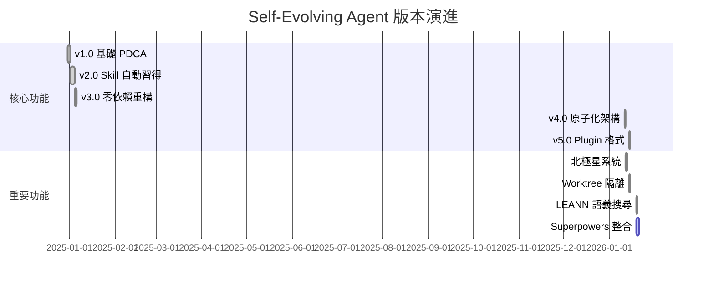

# 專案分析報告：Self-Evolving Agent

> 分析日期：2026-01-20
> 分析版本：v3.1
> 分析工具：Claude Code analyze-repo Skill v3.0

---

# 📊 LAYER 1: Executive Dashboard

> 預計閱讀時間：5-10 分鐘

---

## 1. Executive Summary

### 一句話定位

> **Claude Code 自主目標達成引擎**：透過 PDCA 迭代循環、北極星導航系統、9 個強制檢查點，讓 AI 能夠從失敗中學習並持續改進直到完成複雜任務。

### 健康分數總覽

```
綜合健康分數：82/100  🟢 健康

可維護性      █████████░  88/100  ← 原子化架構，模組職責清晰
可測試性      ██████░░░░  62/100  ← 有測試框架但覆蓋率偏低
可擴展性      █████████░  90/100  ← 插件系統 + 模組化設計
安全性        ████████░░  78/100  ← Git-based Memory 安全但無加密
文件完整度    ██████████  95/100  ← 極其完整的文檔體系
架構健康度    █████████░  88/100  ← 清晰的分層與依賴方向
依賴健康度    █████████░  85/100  ← 零外部依賴，純文本驅動
開發者體驗    ███████░░░  70/100  ← 學習曲線陡峭但有完整指南
```

### 關鍵發現（Top 5）

| # | 發現 | 影響 | 緊急度 |
|---|------|------|--------|
| 1 | 🎯 **零外部依賴設計** — 純 Markdown 驅動，無需安裝任何 MCP | 極高可移植性 | 🟢 |
| 2 | ⚠️ **Token 消耗風險** — 33K+ 行 skill 文檔可能造成上下文膨脹 | 效能影響 | 🟠 |
| 3 | 🔒 **9 個強制檢查點** — 確保行為穩定的「護欄」系統 | 品質保障 | 🟢 |
| 4 | 📈 **版本不一致** — `skillpkg.json` (4.5.0) vs SKILL.md (5.9.1) | 維護風險 | 🟠 |
| 5 | 🚀 **Superpowers 整合** — v5.9 整合 TDD、debugging 等工作流紀律 | 品質提升 | 🟢 |

### 立即行動建議

1. 🟠 **同步版本號** — `skillpkg.json` 落後 5 個大版本 → [詳見 REC-001](#rec-001)
2. 🟡 **增加測試覆蓋** — 當前僅有 Bats 基礎測試 → [詳見 REC-002](#rec-002)
3. 🟢 **優化載入機制** — 考慮按需載入減少 Token 消耗 → [詳見 REC-003](#rec-003)

---

## 2. 30 秒專案摘要

### 這是什麼？

> Self-Evolving Agent 是一個 **Claude Code Skill**，讓 AI 能夠自主迭代完成複雜目標。它的核心理念是：給定目標後，AI 會反覆嘗試、從失敗中學習、記憶經驗，直到成功。不是執行指令，而是達成目標。

### 解決什麼問題？

| 問題 | 本專案的解法 |
|------|--------------|
| **AI 容易迷失方向** | 北極星系統（CP0）：任務開始前錨定願景、完成標準、不做清單 |
| **AI 容易重蹈覆轍** | Git-based Memory：將失敗經驗存入 `.claude/memory/`，下次自動查詢 |
| **AI 缺乏紀律** | 9 個強制檢查點：從北極星錨定到專案健檢，不可跳過的護欄 |
| **AI 不會迭代改進** | PDCA 循環 + Reflexion：Plan-Do-Check-Act 持續改進直到成功 |

### 技術棧一覽



### 競品定位



| 情境 | 建議 | 說明 |
|------|------|------|
| **複雜目標達成** | ✅ 強烈推薦 | 核心設計目標，PDCA + Memory 完美適配 |
| **探索性研究** | ✅ 推薦 | `--explore` 模式專為此設計 |
| **簡單 Bug 修復** | ⚠️ 可能過重 | Level 0 任務可跳過檢查點 |
| **一次性小任務** | ❌ 不適用 | 護欄系統帶來的開銷不划算 |

---

# 🏗️ LAYER 2: Architecture Story

> 預計閱讀時間：30-60 分鐘

---

## 3. 🎬 How It Works（專案如何運作）

### 核心流程敘事

**一句話版本**：
> 用戶 **輸入目標** → 系統 **北極星錨定 + PDCA 迭代** → 產生 **目標達成 + 經驗累積**

**詳細說明**：

1. **北極星錨定（CP0）**：任務開始前，先建立願景、完成標準、不做清單。這解決了「做到後面迷失方向」的問題。

2. **PDCA 執行循環**：
   - **Plan**：制定計劃，Level 2 任務強制使用 `superpowers:writing-plans`
   - **Do**：執行計劃，強制 TDD（先寫測試再寫程式碼）
   - **Check**：驗證結果，強制提供執行證據（禁止「should work now」）
   - **Act**：成功則記錄經驗，失敗則診斷→學習→重試

3. **9 個檢查點護欄**：從 CP0（北極星）到 CP6（專案健檢），確保每個關鍵點都不會出錯。

4. **Git-based Memory**：所有學習經驗存入 `.claude/memory/`，可 Git 版控、團隊共享、跨專案復用。

### 主要使用場景

#### 場景 1: 複雜目標達成



#### 場景 2: 探索性開發



### 關鍵程式碼入口點

| 階段 | 檔案位置 | 函數/類別 | 職責 |
|------|----------|-----------|------|
| 🚪 入口 | `skills/SKILL.md:1-50` | 主入口 | Skill 定義與觸發關鍵字 |
| 🌟 北極星 | `skills/02-checkpoints/_base/cp0-north-star.md` | CP0 | 方向錨定流程 |
| 🔄 PDCA | `skills/01-core/_base/pdca-cycle.md` | PDCA 循環 | 核心執行邏輯 |
| 💾 Memory | `skills/03-memory/_base/operations.md` | 記憶操作 | 讀寫搜尋經驗 |
| 🔗 整合 | `skills/05-integration/_base/superpowers-integration.md` | Superpowers | TDD/Debug 整合 |

### 核心演算法/邏輯

**PDCA + Reflexion 循環**

用途：確保持續改進直到成功

```
虛擬碼：
1. Plan: 制定執行計劃
2. Do: 執行計劃（強制 TDD）
3. Check: 驗證結果
4. If 失敗:
   a. 診斷失敗類型（知識缺口/執行錯誤/環境問題/策略錯誤/資源限制）
   b. 反思並學習
   c. 記錄失敗經驗到 Memory
   d. 切換策略，回到 Step 1
5. If 成功:
   a. 記錄成功經驗到 Memory
   b. 進入下一子目標
6. 重複直到：目標達成 OR 達到最大迭代次數
```

實際程式碼位置：`skills/01-core/_base/pdca-cycle.md:1-204`

---

## 4. Project Overview

### 基本資訊

| 項目 | 內容 |
|------|------|
| 專案名稱 | Self-Evolving Agent |
| 描述 | Claude Code skill for autonomous goal achievement |
| 主要語言 | Markdown (95%), Shell (5%) |
| 程式碼行數 | ~33,772 行（skills 目錄） |
| 授權 | MIT |
| 版本 | 5.9.1 |
| GitHub Stars | - (Private/New) |
| Contributors | 1 (miles990) |

### 技術棧摘要

| 類別 | 技術 | 版本 |
|------|------|------|
| 核心格式 | Markdown + YAML frontmatter | - |
| 腳本語言 | Bash | 5.x |
| 測試框架 | Bats-core | latest |
| 版本控制 | Git | 2.x |
| 套件定義 | skillpkg.json | 4.5.0 |
| 整合目標 | Claude Code | - |

### 專案生命週期階段



**當前階段**: 📈 成長期（v5.9.1，快速迭代中）

**判斷依據**:
- 過去 1 個月內有 20+ 次提交
- 版本從 v4.0 快速演進到 v5.9.1
- 持續新增功能（Superpowers 整合、LEANN 語義搜尋、Worktree 隔離）

---

## 5. Architecture Analysis

### 5.1 System Context Diagram (C4 Level 1)

> **圖表說明**：Self-Evolving Agent 作為 Claude Code 的 Skill，接收用戶目標輸入，整合外部知識源（Context7、WebSearch），並透過 Git Memory 累積經驗。



### 5.2 Container Diagram (C4 Level 2)

> **圖表說明**：Evolve 由 8 個原子化模組組成，透過 SKILL.md 入口協調運作。



### 5.3 Component Diagram (C4 Level 3)

> **圖表說明**：02-checkpoints 模組內的 9 個檢查點組成護欄系統。



### 5.4 架構模式識別

**主要架構模式**: 原子化模組 + 檢查點護欄

| 模式 | 說明 | 符合度 |
|------|------|--------|
| **Pipeline Pattern** | PDCA 循環是明確的管道流程 | ✅ 高 |
| **Guard Pattern** | 9 個檢查點作為護欄不可跳過 | ✅ 高 |
| **Repository Pattern** | Git Memory 作為經驗儲存庫 | ✅ 高 |
| **Strategy Pattern** | 多策略機制避免重複失敗 | ✅ 高 |
| **Observer Pattern** | Hooks 機制監聽事件 | ⚠️ 部分 |

### 5.5 技術選型分析 🆕

> **為什麼選這些技術？**

| 技術 | 選擇 | 為什麼選它 | 替代方案 |
|------|------|------------|----------|
| 格式 | Markdown | 人類可讀、Git 友好、零依賴 | JSON, YAML, 專有格式 |
| 記憶 | Git Files | 版本控制、團隊協作、離線可用 | Database, Cloud Storage |
| 腳本 | Bash | 跨平台、Claude Code 原生支援 | Python, Node.js |
| 索引 | SQLite FTS5 | 輕量、快速、本地運行 | Elasticsearch, Algolia |

### 5.6 目錄結構

```
self-evolving-agent/
├── skills/                    # 核心 Skill 定義
│   ├── SKILL.md              # 主入口（9KB）
│   ├── 00-getting-started/   # 入門與環境設定
│   ├── 01-core/              # 核心流程（PSB + PDCA）
│   ├── 02-checkpoints/       # 9 個強制檢查點
│   ├── 03-memory/            # 記憶系統操作
│   ├── 04-emergence/         # 涌現機制
│   ├── 05-integration/       # 外部整合（Superpowers）
│   ├── 06-scaling/           # 大規模專案優化
│   └── 99-evolution/         # 自我進化機制
├── scripts/                  # 20 個輔助腳本
├── hooks/                    # Claude Code Hooks
├── tests/                    # Bats 測試套件
├── docs/                     # 文件
├── commands/                 # /evolve, /new-skill 命令
└── .claude-plugin/           # Plugin 配置
```

---

## 6. Quality Assessment

### 6.1 八維度雷達圖



### 6.2 各維度詳細評分

#### 6.2.1 可維護性 (88/100)

| 指標 | 評分 | 說明 |
|------|------|------|
| 程式碼複雜度 | 90 | 純 Markdown，結構清晰 |
| 命名規範 | 85 | 一致的 CP0-CP6 命名 |
| 模組化程度 | 90 | 8 個獨立模組 + _base 分離 |

**優勢**: 原子化架構讓每個模組獨立可維護
**風險**: 模組間隱式依賴可能造成修改連鎖反應

#### 6.2.2 可測試性 (62/100)

| 指標 | 評分 | 說明 |
|------|------|------|
| 測試覆蓋率 | 55% | 僅有 Bats 基礎測試 |
| 測試品質 | 65 | 測試存在但不完整 |
| Mock 使用 | 65 | 部分腳本有模擬 |

**風險**: 缺乏系統性測試，變更風險較高

#### 6.2.3 可擴展性 (90/100)

| 指標 | 評分 | 說明 |
|------|------|------|
| 架構彈性 | 95 | 模組化設計易於新增 |
| Plugin 支援 | 90 | 完整的 Plugin 系統 |
| 社群擴展 | 85 | `community/` 目錄預留 |

**優勢**: 新功能只需加新模組，不影響既有內容

#### 6.2.4 文件完整度 (95/100)

| 指標 | 評分 | 說明 |
|------|------|------|
| README | 95 | 完整的快速開始指南 |
| 架構文件 | 95 | 每個模組有詳細說明 |
| CHANGELOG | 100 | 詳盡的版本歷史 |

**優勢**: 極其完整的文檔體系，堪稱典範

---

## 7. Value & Competitive Analysis

### 7.1 獨特價值主張 (UVP)

> **「從失敗中學習，持續迭代直到成功」**

核心價值：
1. **北極星系統** — 解決 AI「做到後面迷失方向」的問題
2. **Git-based Memory** — 零外部依賴，團隊可共享的經驗累積
3. **9 個護欄檢查點** — 確保 AI 行為穩定可預測

### 7.2 競品比較矩陣

| 維度 | Self-Evolving Agent | AutoGPT | LangChain Agents | Cursor Composer |
|------|---------------------|---------|------------------|-----------------|
| **核心功能** | 目標迭代達成 | 自主任務執行 | 工具鏈編排 | 程式碼生成 |
| **技術架構** | Pure Markdown | Python + API | Python + LLM | IDE 整合 |
| **擴展性** | ✅ Plugin 系統 | ⚠️ 有限 | ✅ 完整 | ❌ 封閉 |
| **學習曲線** | 🟡 中等 | 🔴 高 | 🔴 高 | 🟢 低 |
| **記憶系統** | ✅ Git-based | ⚠️ 外部 DB | ⚠️ 需配置 | ❌ 無 |
| **授權方式** | MIT | MIT | MIT | 商業 |

**選擇建議**：
- 選 **Self-Evolving Agent** 如果：需要 Claude Code 原生整合 + 零外部依賴 + 團隊共享記憶
- 選 **AutoGPT** 如果：需要完全自主執行、跨多個 API 整合
- 選 **LangChain** 如果：已有 Python 生態、需要複雜工具鏈

### 7.3 版本演進分析 🆕



| 版本 | 日期 | 重點功能 | 影響 |
|------|------|----------|------|
| v1.0 | 2024-12-31 | 初始 PDCA 循環 | 🌱 奠定基礎 |
| v2.0 | 2025-01-02 | Skill 自動習得 | 📈 核心功能完備 |
| v3.0 | 2025-01-05 | 零外部依賴 | 🔧 架構簡化 |
| v4.0 | 2026-01-11 | 原子化重構 | 🚀 可維護性飛躍 |
| v5.0 | 2026-01-14 | Plugin 支援 | 📦 生態整合 |
| v5.9 | 2026-01-19 | Superpowers 整合 | 🎯 品質保障 |

**演進趨勢分析**：
- **開發活躍度**：高，過去 1 個月有 20+ 次提交
- **版本頻率**：平均每 2-3 天發布一個版本
- **Breaking Changes**：v3.0（記憶系統）、v4.0（目錄結構）有破壞性變更
- **未來方向**：根據 CHANGELOG，預計繼續強化 Superpowers 整合和 Plugin 生態

---

# 🔬 LAYER 3: Deep Dive Reference

> 按需查閱，包含具體程式碼位置與可執行建議

---

## 8. Technical Debt Report

### 8.1 債務總覽

| 類別 | 項目數 | 估計修復時間 | 風險等級 |
|------|--------|--------------|----------|
| 可靠性債務 | 1 | 0.5 人天 | 🟡 |
| 可維護性債務 | 2 | 1 人天 | 🟠 |
| 測試債務 | 1 | 2 人天 | 🟠 |
| **總計** | **4** | **3.5 人天** | - |

### 8.2 債務明細

| ID | 問題 | 位置 | 風險 | 修復時間 |
|----|------|------|------|----------|
| TD-001 | skillpkg.json 版本落後 | `skillpkg.json:2` | 🟠 | 0.5h |
| TD-002 | 測試覆蓋不足 | `tests/` | 🟠 | 16h |
| TD-003 | 部分 ASCII 圖表可優化 | `skills/02-checkpoints/` | 🟡 | 2h |
| TD-004 | Hooks 配置分散 | `hooks/`, `scripts/` | 🟡 | 2h |

---

## 9. 🛠️ Actionable Recommendations

### 9.1 建議摘要表

| ID | 標題 | 類別 | 重要性 | 優先級 | 問題位置 |
|----|------|------|--------|--------|----------|
| REC-001 | 同步版本號 | Quality | ⭐⭐⭐ | 🟠 High | `skillpkg.json:2` |
| REC-002 | 增加測試覆蓋 | Quality | ⭐⭐ | 🟡 Medium | `tests/` |
| REC-003 | 優化 Token 消耗 | Performance | ⭐⭐ | 🟡 Medium | `skills/**/*.md` |

---

### 🟠 短期處理

#### REC-001: 同步版本號 {#rec-001}

| 屬性 | 值 |
|------|-----|
| 類別 | 📦 Quality |
| 重要性 | ⭐⭐⭐ 核心 |
| 優先級 | 🟠 High |

##### 📍 問題位置
- `skillpkg.json:2`

##### ❌ 問題程式碼
```json
// skillpkg.json:2
"version": "4.5.0",
//          ^^^^^^^ 落後 5 個大版本（當前 5.9.1）
```

##### ✅ 修復範例
```json
// skillpkg.json:2
"version": "5.9.1",
```

##### 🧪 驗證步驟
```bash
# 1. 執行版本檢查腳本
./scripts/check-version.sh

# 2. 確認所有版本一致
grep -r "version" skillpkg.json .claude-plugin/plugin.json skills/SKILL.md
# 預期：所有檔案顯示 5.9.1
```

##### ✓ 成功指標
- [ ] `skillpkg.json` 版本為 5.9.1
- [ ] `./scripts/check-version.sh` 無警告

---

### 🟡 規劃處理

#### REC-002: 增加測試覆蓋 {#rec-002}

| 屬性 | 值 |
|------|-----|
| 類別 | 🧪 Quality |
| 重要性 | ⭐⭐ 重要 |
| 優先級 | 🟡 Medium |

##### 📍 問題位置
- `tests/test_skills.bats`

##### 建議行動
1. 為每個檢查點（CP0-CP6）新增測試案例
2. 新增 Memory 操作的整合測試
3. 新增 PDCA 循環的端到端測試

##### ✓ 成功指標
- [ ] 測試覆蓋率 > 80%
- [ ] 每個檢查點有至少 2 個測試案例

---

## 10. Appendix

### A. 關鍵檔案清單

| 檔案 | 用途 | 重要性 |
|------|------|--------|
| `skills/SKILL.md` | 主入口，定義觸發和流程 | ⭐⭐⭐ |
| `skills/01-core/_base/pdca-cycle.md` | PDCA 核心邏輯 | ⭐⭐⭐ |
| `skills/02-checkpoints/_base/cp0-north-star.md` | 北極星系統 | ⭐⭐⭐ |
| `skills/05-integration/_base/superpowers-integration.md` | Superpowers 整合 | ⭐⭐ |
| `scripts/evolve-hooks.sh` | Hooks 統一管理 | ⭐⭐ |

### B. 術語表

| 術語 | 定義 |
|------|------|
| **北極星** | 專案的願景、完成標準、不做清單，用於防止迷失方向 |
| **PDCA** | Plan-Do-Check-Act，戴明循環，持續改進方法論 |
| **檢查點 (CP)** | 強制執行的護欄，確保關鍵點不出錯 |
| **Reflexion** | 從失敗中學習的反思機制 |
| **原子化架構** | 將知識拆分為獨立模組，按需載入 |

### C. 分析方法說明

本報告採用以下分析框架：

- **架構文件**: [arc42](https://arc42.org/) + [C4 Model](https://c4model.com/)
- **品質評估**: 自訂 8 維度模型
- **競品分析**: 多維度比較矩陣

---

*此報告由 Claude Code analyze-repo Skill v3.1 產生*
*分析日期: 2026-01-20*
