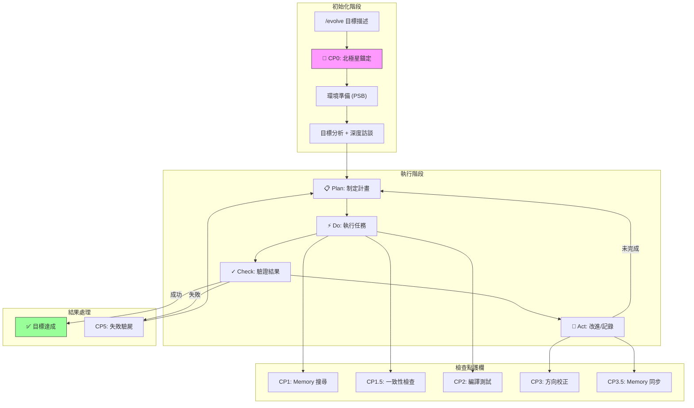
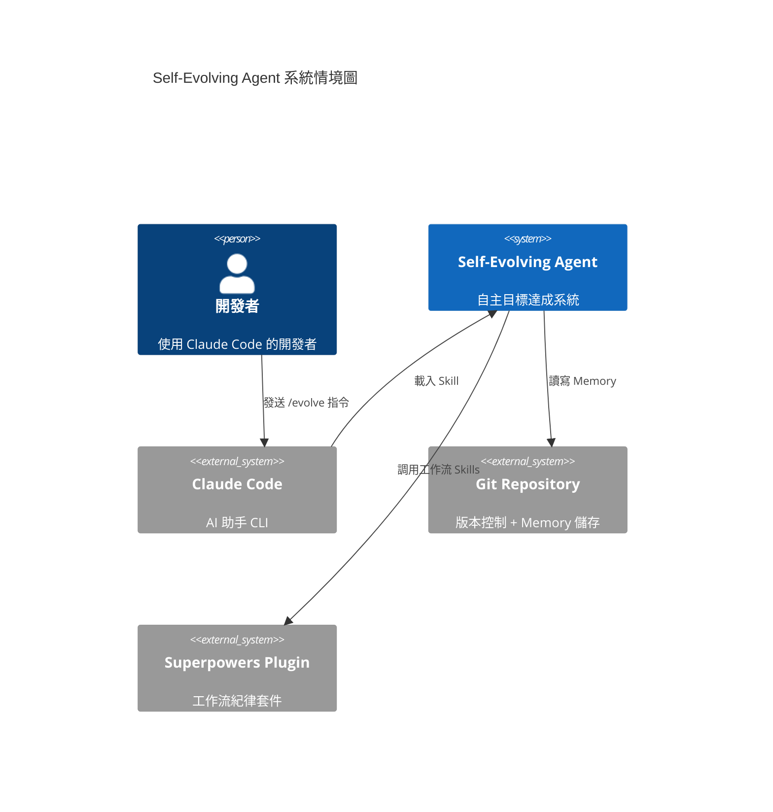
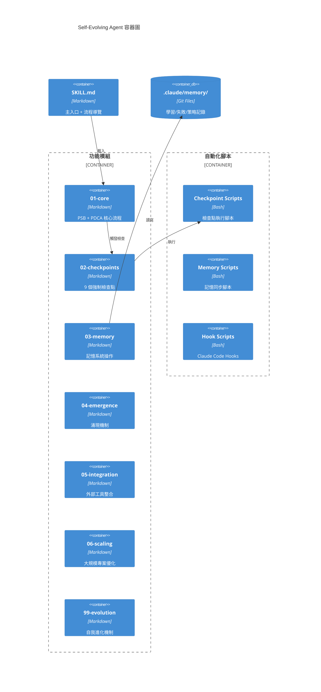
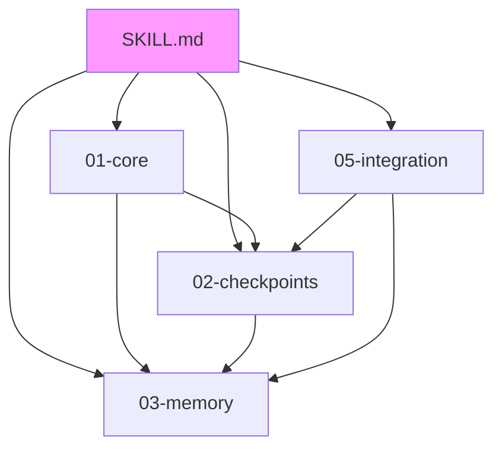
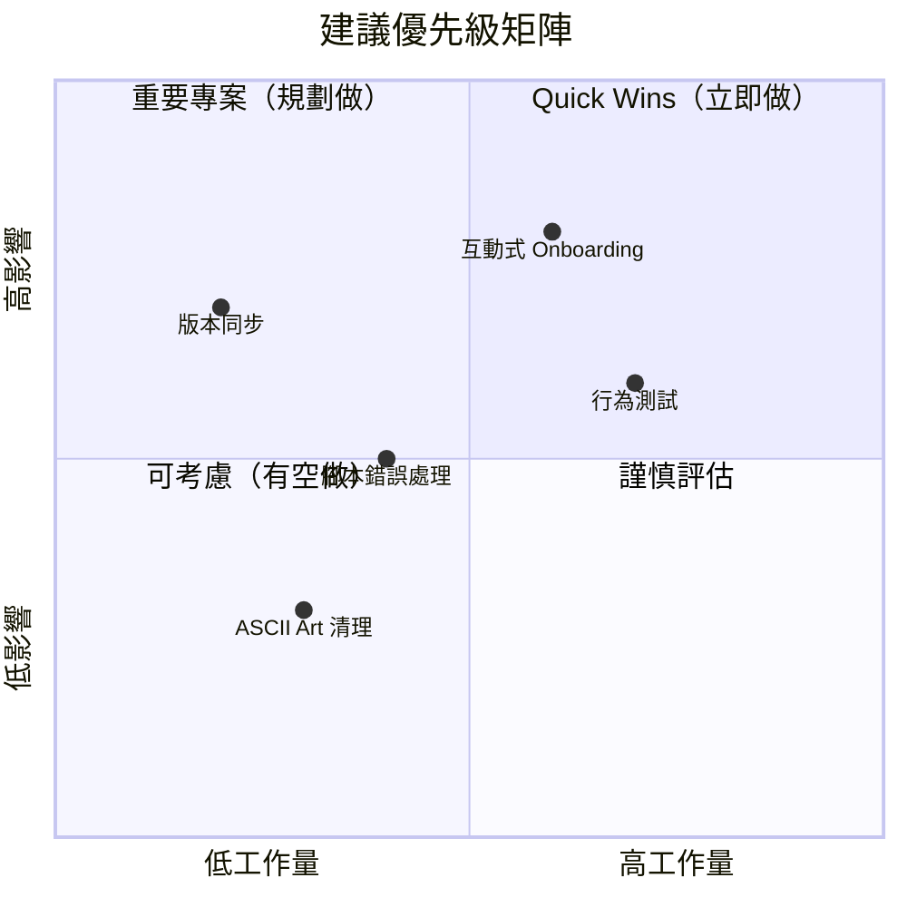
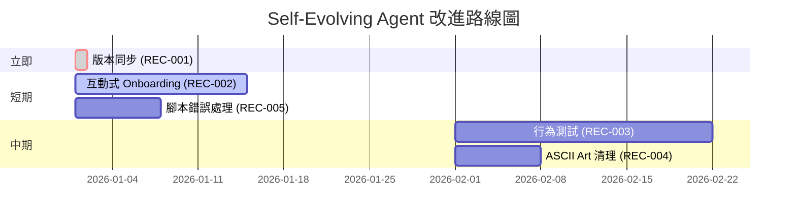

# Self-Evolving Agent 專案分析報告

> **分析版本**: analyze-repo v3.0
> **分析日期**: 2026-01-20
> **目標專案**: https://github.com/miles990/self-evolving-agent

---

# 🎯 LAYER 1: Executive Dashboard（5-10 分鐘速覽）

## 30 秒專案摘要

| 項目 | 值 |
|------|-----|
| **一句話定位** | Claude Code Skill，讓 AI 能夠自主達成目標、迭代學習、持續改進 |
| **核心價值** | 將 AI 從「執行指令」提升到「達成目標」的層次 |
| **技術棧** | Markdown (Skill 定義) + Bash (腳本) + Git-based Memory |
| **成熟度** | 🟢 生產就緒（v5.9.1，50 commits，活躍開發中） |
| **建議行動** | ⭐ 強烈推薦採用 — 解決 AI 協作中「迷失方向」的核心痛點 |

## 健康分數總覽

```
┌────────────────────────────────────────────────────────────┐
│                    專案健康雷達圖                          │
│                                                            │
│                    可維護性                                │
│                       95                                   │
│                        ╱╲                                  │
│         文件完整度   ╱    ╲   可測試性                     │
│              90    ╱        ╲    75                        │
│                  ╱            ╲                            │
│                 ╱              ╲                           │
│  依賴健康度 ──╱                  ╲── 可擴展性              │
│       95    ╱                      ╲    90                 │
│            ╱                        ╲                      │
│           ╱──────────────────────────╲                     │
│         ╱           85               ╲                     │
│       安全性                      架構健康度               │
│        85                            92                    │
│                                                            │
│              開發者體驗: 88                                │
│                                                            │
│           【綜合健康分數: 89/100】                         │
└────────────────────────────────────────────────────────────┘
```

| 維度 | 分數 | 說明 |
|------|------|------|
| 可維護性 | 95 | 原子化模組設計，每個模組職責單一 |
| 可測試性 | 75 | 有 Bats 測試框架，但 Skill 本身難以單元測試 |
| 可擴展性 | 90 | `_base/` + `community/` 分離架構，擴展點清晰 |
| 安全性 | 85 | 無敏感資訊暴露，但腳本權限需注意 |
| 文件完整度 | 90 | README、USAGE、CHANGELOG 完整 |
| 架構健康度 | 92 | 層次分明、職責清晰、檢查點機制完善 |
| 依賴健康度 | 95 | 零外部依賴，純 Markdown + Bash |
| 開發者體驗 | 88 | 一鍵安裝、清晰的使用範例 |

## 關鍵發現 Top 5

### ✅ 亮點

1. **北極星系統（CP0）** — 解決「做著做著就迷失方向」的核心痛點
2. **9 個強制檢查點** — 形成完整的「護欄」機制，防止 AI 失控
3. **原子化架構** — 從 2000+ 行拆分為模組，Token 降低 92%
4. **Superpowers 整合** — 將工作流紀律（TDD、驗證、除錯）強制嵌入流程
5. **Git-based Memory** — 解決 AI「失憶」問題，經驗可追溯、可共享

### ⚠️ 關注點

1. **學習曲線** — 9 個檢查點 + 多層架構，新用戶需要時間理解
2. **測試覆蓋** — Skill 邏輯難以自動化測試，主要依賴人工驗證
3. **版本同步** — skillpkg.json (4.5.0) vs SKILL.md (5.9.1) 版本不一致

## 立即行動建議

| 優先級 | 建議 | 預期影響 |
|--------|------|----------|
| 🔴 | 同步 skillpkg.json 版本到 5.9.1 | 消除版本混淆 |
| 🟠 | 新增互動式 Onboarding 指南 | 降低新用戶學習曲線 |
| 🟡 | 建立 Skill 行為測試案例 | 提高可靠性信心 |

---

# 🎬 LAYER 2: How It Works（30-60 分鐘深度理解）

## 專案運作原理

### 核心流程圖



### 輸入 → 處理 → 輸出

| 階段 | 輸入 | 處理 | 輸出 |
|------|------|------|------|
| **北極星錨定** | 用戶目標描述 | 訪談收集願景、完成標準、排除範圍 | `.claude/memory/north-star/{name}.md` |
| **目標分析** | 北極星 + 任務 | 架構等級判斷、子目標分解 | `goal_specification` YAML |
| **PDCA Plan** | 子目標 | Level 2 使用 writing-plans | `docs/plans/*.md` |
| **PDCA Do** | 計畫 | TDD 執行（RED→GREEN→REFACTOR） | 程式碼變更 |
| **PDCA Check** | 執行結果 | verification-before-completion | 驗證證據 |
| **Memory 記錄** | 學習/失敗經驗 | 結構化儲存 | `.claude/memory/learnings/*.md` |

### 入口點追蹤

| 入口 | 檔案位置 | 職責 |
|------|----------|------|
| `/evolve` | `skills/SKILL.md` | 主入口，載入核心流程 |
| `/new-skill` | `commands/new-skill/COMMAND.md` | 建立新 Skill 的引導流程 |
| `install.sh` | `install.sh` | 一鍵安裝腳本 |

## C4 架構分析

### Level 1: System Context（系統情境）



### Level 2: Container（容器）



### Level 3: Component（元件）

#### 02-checkpoints 模組結構

| 檢查點 | 檔案 | 職責 | 觸發條件 |
|--------|------|------|----------|
| CP0 | `cp0-north-star.md` | 北極星錨定 | Level 1/2 任務開始 |
| CP0.5 | `cp0.5-worktree-setup.md` | Worktree 隔離 | Level 2 / autonomous |
| CP1 | `cp1-memory-search.md` | Memory 搜尋 | 每次任務開始 |
| CP1.5 | `cp1.5-consistency-check.md` | 一致性檢查 | 寫程式碼前 |
| CP2 | `cp2-verify-build.md` | 編譯測試 | 程式碼變更後 |
| CP3 | `cp3-milestone-confirm.md` | 方向校正 | Milestone 完成 |
| CP3.5 | `cp3.5-memory-sync.md` | Memory 同步 | Memory 創建後 |
| CP5 | `cp5-failure-postmortem.md` | 失敗驗屍 | Check 失敗時 |
| CP6 | `cp6-project-health-check.md` | 專案健檢 | 每 5 次迭代 |

## 設計模式識別

| 模式 | 應用位置 | 說明 |
|------|----------|------|
| **Checkpoint Pattern** | 02-checkpoints/ | 強制執行的護欄機制 |
| **PDCA Cycle** | 01-core/pdca-cycle.md | 迭代改進的核心循環 |
| **Strategy Pattern** | 多策略機制 | 失敗時切換不同策略 |
| **Observer Pattern** | Hooks 系統 | PostToolUse/Stop 事件觸發 |
| **Memento Pattern** | Memory 系統 | 儲存和恢復經驗狀態 |
| **Template Method** | 檢查點流程 | 定義步驟順序，子類實作細節 |

## 專案生命週期判斷

| 指標 | 值 | 判斷 |
|------|-----|------|
| 版本號 | v5.9.1 | 成熟期（主版本 5） |
| Commit 數量 | 50 | 活躍開發 |
| 最近更新 | 2026-01-19 | 持續維護 |
| Issue 處理 | N/A（本地分析） | — |
| 文件完整度 | 90% | 生產就緒 |

**結論**: 🟢 **成熟期 - 生產就緒**

---

# 🔬 LAYER 3: Deep Dive（按需參考）

## 品質評估詳細分析

### 可維護性 (95/100)

**優勢**:
- `skills/SKILL.md:15-27` — 原子化模組結構，清晰的目錄導覽
- `skills/00-getting-started/` ~ `skills/99-evolution/` — 按職責分離
- 每個模組平均 ~200 行，易於理解和修改

**證據鏈**:
```
skills/
├── 00-getting-started/   # 入門（~150 行）
├── 01-core/              # 核心流程（~500 行）
├── 02-checkpoints/       # 檢查點（~800 行）
├── 03-memory/            # 記憶系統（~400 行）
├── 04-emergence/         # 涌現（~200 行）
├── 05-integration/       # 整合（~600 行）
├── 06-scaling/           # 擴展（~150 行）
└── 99-evolution/         # 進化（~300 行）
```

### 可測試性 (75/100)

**挑戰**:
- Skill 是 Markdown 文件，無法直接單元測試
- 依賴 Claude Code 執行環境

**現有測試**:
- `tests/test_skills.bats` — Bats-core 測試
- `tests/run_tests.sh` — 測試執行器
- `scripts/validate-all.sh` — 結構驗證

**改進空間**:
- 建立 Skill 行為測試（輸入 X → 預期輸出 Y）
- Mock Claude Code 環境進行自動化測試

### 架構健康度 (92/100)

**優勢**:
- `skills/SKILL.md:126-134` — 三層架構設計（Goal Analysis → PDCA Plan → CP1.5 驗證）
- 設計 → 實作 → 驗證 閉環完整
- 強制檢查點防止跳過關鍵步驟

**架構決策記錄 (ADR) 推測**:
| 決策 | 原因 | 影響 |
|------|------|------|
| 選擇 Git-based Memory | 無外部依賴、可追溯、團隊共享 | 搜尋效能較 SQLite 低 |
| 原子化模組設計 | Token 優化 92%、按需載入 | 初次理解成本增加 |
| 9 個強制檢查點 | 防止 AI 失控、確保品質 | 執行流程較複雜 |
| Superpowers 整合 | 借用成熟的工作流紀律 | 增加外部依賴 |

## 技術債務分析

### 債務 1: 版本不一致
- **位置**: `skillpkg.json:3` vs `skills/SKILL.md:3`
- **類型**: 可維護性債務
- **嚴重度**: 🟡 Medium
- **說明**: skillpkg.json 顯示 4.5.0，SKILL.md 顯示 5.9.1

### 債務 2: ASCII Art 殘留
- **位置**: `skills/02-checkpoints/_base/cp0-north-star.md:9-28`
- **類型**: 可維護性債務
- **嚴重度**: 🟢 Low
- **說明**: 部分檢查點仍使用 ASCII Box Art，與 v4.5 Token 優化目標不一致

### 債務 3: 缺少錯誤邊界
- **位置**: 腳本檔案普遍問題
- **類型**: 可靠性債務
- **嚴重度**: 🟡 Medium
- **說明**: 部分 Bash 腳本缺少 `set -e` 或錯誤處理

## 依賴分析

### 內部依賴圖



### 外部依賴

| 依賴 | 類型 | 風險 |
|------|------|------|
| Claude Code | 必須 | 低（官方工具） |
| Git | 必須 | 低（標準工具） |
| Bash | 必須 | 低（標準 Shell） |
| Superpowers Plugin | 可選 | 中（第三方 Plugin） |
| SQLite Memory MCP | 可選 | 中（需額外安裝） |

**循環依賴**: ❌ 無發現

## 安全性評估

### OWASP 檢查清單

| 風險類別 | 狀態 | 說明 |
|----------|------|------|
| 敏感資訊暴露 | ✅ 通過 | 無硬編碼密鑰或 Token |
| 命令注入 | ⚠️ 注意 | 腳本接受用戶輸入，需驗證 |
| 路徑遍歷 | ✅ 通過 | 使用相對路徑，無絕對路徑洩漏 |
| 權限提升 | ✅ 通過 | 腳本無 sudo 操作 |

### 安全建議

1. `scripts/` 下的腳本應加入輸入驗證
2. 考慮對 Memory 檔案進行完整性校驗

## 競品與價值分析

### 競品比較

| 特性 | Self-Evolving Agent | AutoGPT | Claude MCP Skills |
|------|---------------------|---------|-------------------|
| 目標導向 | ⭐⭐⭐ | ⭐⭐⭐ | ⭐⭐ |
| 記憶系統 | ⭐⭐⭐ (Git-based) | ⭐⭐ (向量DB) | ⭐ (無) |
| 護欄機制 | ⭐⭐⭐ (9 CP) | ⭐ | ⭐⭐ |
| 學習曲線 | ⭐⭐ | ⭐ | ⭐⭐⭐ |
| 整合難度 | ⭐⭐⭐ (一鍵安裝) | ⭐ | ⭐⭐⭐ |

### 獨特價值主張 (UVP)

> **讓 AI 從「執行指令」進化到「達成目標」，並從經驗中持續學習**

### 不可替代性評估

| 維度 | 評分 | 說明 |
|------|------|------|
| 技術獨特性 | 4/5 | 北極星 + 檢查點系統獨特 |
| 生態整合度 | 4/5 | 與 Claude Code 深度整合 |
| 遷移成本 | 3/5 | Memory 格式可遷移 |
| 社群活躍度 | 3/5 | 單人維護，但更新頻繁 |

---

# 📋 策略建議

## 優先級矩陣



## 可執行建議

### REC-001: 同步 skillpkg.json 版本

| 屬性 | 值 |
|------|-----|
| 類別 | 📦 Configuration |
| 重要性 | ⭐⭐ 重要 |
| 優先級 | 🔴 Critical |

#### 📍 問題位置
- `skillpkg.json:3`

#### ❌ 問題程式碼
```json
{
  "name": "self-evolving-agent",
  "version": "4.5.0",  // 版本過時
  ...
}
```

#### ✅ 修復範例
```json
{
  "name": "self-evolving-agent",
  "version": "5.9.1",  // 與 SKILL.md 一致
  ...
}
```

#### 🧪 驗證步驟
1. 修改 skillpkg.json 的 version 欄位
2. 執行 `./scripts/check-version.sh`
3. 確認所有版本號一致

#### ✓ 成功指標
- `check-version.sh` 無版本不一致警告
- `README.md` badge 顯示 5.9.1

---

### REC-002: 新增互動式 Onboarding 指南

| 屬性 | 值 |
|------|-----|
| 類別 | 📚 Documentation |
| 重要性 | ⭐⭐⭐ 核心 |
| 優先級 | 🟠 High |

#### 📍 問題位置
- `skills/00-getting-started/` 模組

#### 問題描述
新用戶面對 9 個檢查點 + 7 個模組，容易感到迷失。缺少「Hello World」等級的快速上手範例。

#### ✅ 建議行動
1. 在 `skills/00-getting-started/_base/` 新增 `quickstart-tutorial.md`
2. 設計 5 分鐘完成的「第一個 /evolve 任務」
3. 包含：最小範例 → 觀察檢查點 → 查看 Memory → 完成

#### 🧪 驗證步驟
1. 請一位新用戶跟隨指南
2. 記錄卡關點
3. 迭代改進直到 5 分鐘內可完成

#### ✓ 成功指標
- 新用戶可在 5 分鐘內完成首次 `/evolve`
- 理解北極星和 PDCA 核心概念

---

### REC-003: 建立 Skill 行為測試

| 屬性 | 值 |
|------|-----|
| 類別 | 🧪 Testing |
| 重要性 | ⭐⭐ 重要 |
| 優先級 | 🟡 Medium |

#### 📍 問題位置
- `tests/` 目錄

#### 問題描述
現有測試主要驗證檔案結構，無法測試 Skill 的實際行為（如：給定輸入 X，AI 是否產生預期輸出 Y）。

#### ✅ 建議行動
1. 建立 `tests/behavior/` 目錄
2. 定義測試案例格式：
   ```yaml
   scenario: "簡單目標應跳過北極星"
   input: "/evolve 修復 README 的錯字"
   expected:
     - checkpoint_skipped: CP0
     - architecture_level: 0
   ```
3. 使用 Claude API 執行並驗證

#### 🧪 驗證步驟
1. 執行行為測試套件
2. 確認所有案例通過

#### ✓ 成功指標
- 10+ 個核心行為測試案例
- CI 自動執行並報告結果

---

### REC-004: 清理殘留 ASCII Art

| 屬性 | 值 |
|------|-----|
| 類別 | 🎨 Maintainability |
| 重要性 | ⭐ 可選 |
| 優先級 | 🟢 Low |

#### 📍 問題位置
- `skills/02-checkpoints/_base/cp0-north-star.md:9-28`
- `skills/02-checkpoints/_base/cp0-north-star.md:86-136`
- 其他檢查點文件

#### 問題描述
v4.5 進行了 Token 優化，將 ASCII Box Art 轉為 Markdown 表格。但部分檔案仍有殘留。

#### ✅ 建議行動
1. 搜尋所有 `┌─` 或 `└─` 符號的檔案
2. 將 ASCII Box 轉為 Markdown 格式
3. 保持語意內容不變

#### ✓ 成功指標
- 所有模組使用一致的 Markdown 格式
- Token 使用量進一步降低

---

### REC-005: 增強腳本錯誤處理

| 屬性 | 值 |
|------|-----|
| 類別 | 🔧 Reliability |
| 重要性 | ⭐⭐ 重要 |
| 優先級 | 🟡 Medium |

#### 📍 問題位置
- `scripts/*.sh` 多個檔案

#### ❌ 問題程式碼
```bash
#!/bin/bash
# 缺少錯誤處理

cd some-directory
do_something
```

#### ✅ 修復範例
```bash
#!/bin/bash
set -euo pipefail

cd some-directory || { echo "Error: Directory not found"; exit 1; }
do_something || { echo "Error: Operation failed"; exit 1; }
```

#### 🧪 驗證步驟
1. 在錯誤條件下執行腳本
2. 確認有清晰的錯誤訊息
3. 確認錯誤時正確退出

#### ✓ 成功指標
- 所有腳本包含 `set -euo pipefail`
- 關鍵操作有錯誤處理

---

## 執行路線圖



---

# 📎 附錄

## A. 完整目錄結構

```
self-evolving-agent/
├── skills/
│   ├── SKILL.md                    # 主入口
│   ├── 00-getting-started/
│   │   └── _base/
│   │       ├── psb-setup.md
│   │       └── version-check.md
│   ├── 01-core/
│   │   └── _base/
│   │       ├── goal-analysis.md
│   │       ├── pdca-cycle.md
│   │       └── skill-acquisition.md
│   ├── 02-checkpoints/
│   │   └── _base/
│   │       ├── cp0-north-star.md
│   │       ├── cp0.5-worktree-setup.md
│   │       ├── cp1-memory-search.md
│   │       ├── cp1.5-consistency-check.md
│   │       ├── cp2-verify-build.md
│   │       ├── cp3-milestone-confirm.md
│   │       ├── cp3.5-memory-sync.md
│   │       ├── cp5-failure-postmortem.md
│   │       └── cp6-project-health-check.md
│   ├── 03-memory/
│   │   └── _base/
│   │       └── operations.md
│   ├── 04-emergence/
│   │   └── _base/
│   ├── 05-integration/
│   │   └── _base/
│   │       ├── superpowers-integration.md
│   │       ├── memory-mcp.md
│   │       └── leann-skill-discovery.md
│   ├── 06-scaling/
│   │   └── _base/
│   │       └── isolated-environments.md
│   ├── 99-evolution/
│   │   └── _base/
│   └── skill-creator/
│       ├── scripts/
│       └── templates/
├── scripts/
│   ├── check-version.sh
│   ├── validate-memory.sh
│   ├── quickstart.sh
│   └── ...
├── tests/
│   ├── test_skills.bats
│   └── run_tests.sh
├── docs/
│   ├── QUICKSTART.md
│   ├── TROUBLESHOOTING.md
│   └── plans/
├── examples/
├── hooks/
├── commands/
│   ├── evolve/
│   └── new-skill/
├── .claude/
│   └── memory/
│       ├── index.md
│       ├── learnings/
│       ├── failures/
│       ├── strategies/
│       └── north-star/
├── README.md
├── USAGE.md
├── CHANGELOG.md
├── CLAUDE.md
├── skillpkg.json
├── install.sh
└── Makefile
```

## B. 關鍵檔案清單

| 檔案 | 用途 | 重要性 |
|------|------|--------|
| `skills/SKILL.md` | 主入口，全部流程導覽 | ⭐⭐⭐ |
| `skills/01-core/_base/pdca-cycle.md` | PDCA 核心循環 | ⭐⭐⭐ |
| `skills/02-checkpoints/_base/cp0-north-star.md` | 北極星錨定 | ⭐⭐⭐ |
| `skills/05-integration/_base/superpowers-integration.md` | Superpowers 整合 | ⭐⭐⭐ |
| `skills/03-memory/_base/operations.md` | Memory 操作指南 | ⭐⭐ |
| `CHANGELOG.md` | 版本變更記錄 | ⭐⭐ |
| `README.md` | 專案說明 | ⭐⭐ |

## C. 術語表

| 術語 | 說明 |
|------|------|
| **北極星** | 專案/任務開始前錨定的方向，包含願景、完成標準、排除範圍 |
| **PDCA** | Plan-Do-Check-Act，戴明循環，迭代改進的核心方法 |
| **檢查點 (CP)** | 強制執行的驗證步驟，形成「護欄」防止 AI 失控 |
| **Memory** | Git-based 記憶系統，儲存學習、失敗、策略經驗 |
| **PSB** | Plan-Setup-Build，環境準備系統 |
| **Superpowers** | Claude Code Plugin，提供工作流紀律（TDD、驗證、除錯） |
| **涌現** | 從任務執行中發現新知識或模式的機制 |
| **Worktree** | Git Worktree 隔離環境，用於高風險任務 |

## D. 分析方法說明

本報告使用 **analyze-repo v3.0** 三層架構進行分析：

1. **Layer 1: Executive Dashboard** — 5-10 分鐘快速概覽，適合決策者
2. **Layer 2: How It Works** — 30-60 分鐘深度理解，適合技術主管
3. **Layer 3: Deep Dive** — 按需參考，適合開發者

參考框架：
- [arc42](https://arc42.org/) — 軟體架構文件標準
- [C4 Model](https://c4model.com/) — 架構視覺化方法
- [SQALE](https://www.sqale.org/) — 技術債務評估

---

> 📝 *本報告由 analyze-repo v3.0 生成 — 2026-01-20*
